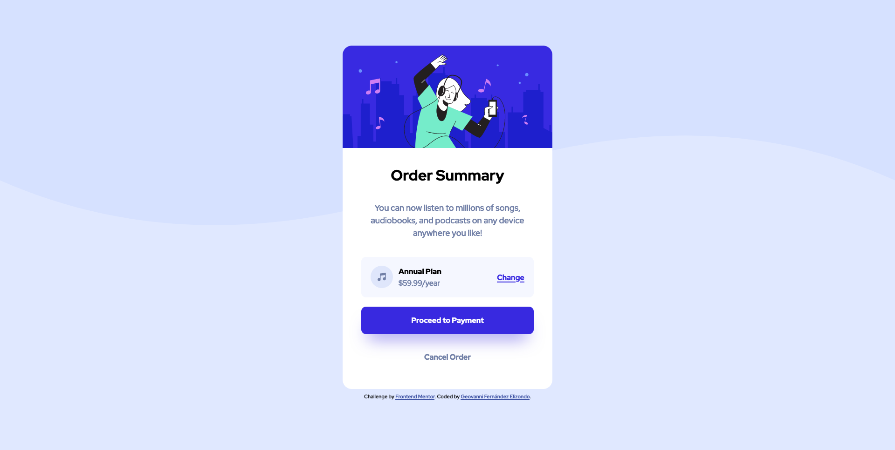

# Frontend Mentor - Order summary card solution

This is a solution to the [Order summary card challenge on Frontend Mentor](https://www.frontendmentor.io/challenges/order-summary-component-QlPmajDUj). Frontend Mentor challenges help you improve your coding skills by building realistic projects.

## Table of contents

- [Overview](#overview)
  - [Screenshot](#screenshot)
  - [Links](#links)
- [My process](#my-process)
  - [Built with](#built-with)
- [Author](#author)

## Overview

This is a solution to the [Order Summary Card challenge on Frontend Mentor](https://www.frontendmentor.io)

### Screenshot

### Links

- Solution URL: [Frontend Mentor Solution]()
- Live Site URL: [https://order-summary-component-gfz.netlify.app/](https://order-summary-component-gfz.netlify.app/)

## My process

### Built with

- Semantic HTML5 markup
- CSS custom properties
- BEM methodology
- Mobile-first workflow

## Author

- Frontend Mentor - [@Geovanex24](https://www.frontendmentor.io/profile/Geovanex24)
- Twitter - [@geovanex24](https://www.twitter.com/geovanex24)
